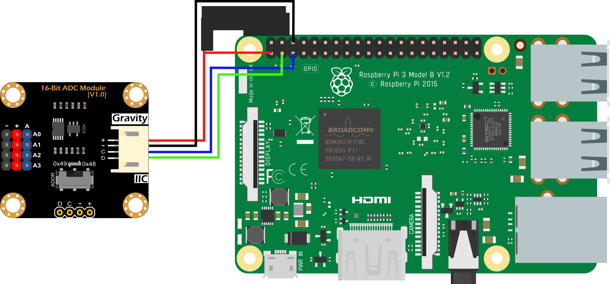

# DFRobot BME280 I²C (temp/pressure/humidity) setup

---

## 🧩 Board Overview


**Connections summary**:

| Num | Label | Description |
|-----|-------|-------------|
| 1 | + | 3.3 |
| 2 | - | GND |
| 3 | C | SCL |
| 4 | D | SDA |


## ⚙️ Hardware and Wiring

**Here’s the correct wiring for Raspberry Pi 5 (or 4, same pinout) (I²C Mode):**

| BME280 Pin | Raspberry Pi Pin | GPIO # | Notes |
|------------|------------------|--------| ----- |
| VIN | 3.3V | pin 1 | – | Power |
| GND | GND | pin 6 | 	– | Ground |
| SCL | SCL | pin 5	| GPIO3	| Clock |
| SDA | SDA | pin 3	| GPIO2	| Data |

🧠 Important:
Use the 3.3V pin, not 5V — the BME280 is a 3.3 V device.
Use Dupont jumper wires (female–female if using header pins).
Double-check orientation: GND next to VIN is a good sanity check.




## 🧪 Configuring Raspberry to read BME280 data:

**Enable I²C on the Raspberry Pi**
Open terminal and run:

```bash
sudo raspi-config
```

Go to Interface Options → I2C → Enable
Go to Finish
(optional) Reboot after enabling.

You can confirm it’s working with:

```bash
sudo apt install -y i2c-tools
i2cdetect -y 1
```

You should see something like:
```bash
     0 1 2 3 4 5 6 7 8 9 a b c d e f
00:          -- -- -- -- -- -- -- --
10: -- -- -- -- -- -- -- -- -- -- -- --
20: -- -- -- -- -- -- -- -- -- -- -- --
30: -- -- -- -- -- -- -- -- -- -- -- --
40: -- -- -- -- -- -- -- -- -- -- -- --
50: -- -- -- -- -- -- -- -- -- -- -- --
60: -- -- -- -- -- -- -- -- --
70: -- -- -- -- -- -- -- 77
```

If you see 77 (or sometimes 76), the BME280 is detected.

**Activate conda environment:**
```bash
conda activate python311
```

**Install the Python Libraries**
```bash
pip install adafruit-blinka board adafruit-circuitpython-bme280 RPi.GPIO adafruit-circuitpython-busdevice lgpio
```

**Test the sensor:**
```bash
python3 bme280/bme280_test.py
``` 

You should see live readings every 2 s.

**If necessary: debug steps:**

```python
#check what's actually available in the library:
import adafruit_bme280

# Check what's available in the module
print("Available attributes in adafruit_bme280:")
print(dir(adafruit_bme280))
```

```python
# Check if there's a basic submodule
try:
    import adafruit_bme280.basic as basic
    print("\nAvailable in adafruit_bme280.basic:")
    print(dir(basic))
except ImportError:
    print("\nNo basic submodule found")
```

```bash
# Check installed versions
conda activate python311
pip list | grep adafruit
```


## Understanding Your Readings:
When you run this script you will see something like:

```bash
python bme280/bme280_test.py 
Initializing I2C...
Connecting to BME280...
BME280 initialized successfully!
Starting readings...

Temperature: 31.17 °C
Humidity: 33.34 %
Pressure: 1009.00 hPa
Altitude: 35.09 m
------
Temperature: 31.19 °C
Humidity: 33.40 %
Pressure: 1009.03 hPa
Altitude: 35.04 m
------
Temperature: 31.17 °C
Humidity: 33.33 %
Pressure: 1009.04 hPa
Altitude: 34.82 m
------
Temperature: 31.16 °C
Humidity: 33.18 %
Pressure: 1009.05 hPa
Altitude: 35.16 m
------
Temperature: 31.19 °C
Humidity: 32.98 %
Pressure: 1009.05 hPa
Altitude: 35.09 m
------
Temperature: 31.19 °C
Humidity: 33.08 %
Pressure: 1009.04 hPa
Altitude: 35.33 m
------
Temperature: 31.18 °C
Humidity: 33.07 %
Pressure: 1009.02 hPa
Altitude: 34.85 m
------
^C
Stopping readings...
```

**Why Pressure and Altitude Values Change**

1. Natural Atmospheric Pressure Variations
- Atmospheric pressure constantly changes due to:
- Weather patterns (high/low pressure systems moving)
- Temperature changes (even small ones affect air density)
- Air circulation in your room
- Barometric pressure changes throughout the day

2. Sensor Precision vs. Accuracy

    Your readings show variations of:
- Pressure: ±0.05 hPa (which is excellent precision!)
- Altitude: ±0.5 meters (calculated from pressure changes)

    This is high-quality sensor performance - the BME280 is detecting real atmospheric changes.

**Your readings analysis**
```bash
Pressure range: 1009.00 - 1009.05 hPa  # Only 0.05 hPa variation!
Altitude range: 34.82 - 35.33 m        # ~0.5m variation (calculated from pressure)
Temperature: 31.16 - 31.19 °C          # Very stable
Humidity: 32.98 - 33.40 %              # Small natural variation
```

**Real-World Context**

Your readings are actually showing realistic environmental changes:

- 1009 hPa is normal atmospheric pressure at sea level
- 35m altitude suggests you might be slightly above sea level (or the sensor's reference is set differently)
- ±0.05 hPa changes happen naturally every few seconds

The "weird" behavior you noticed is actually the sensor working perfectly and detecting real atmospheric micro-variations!

**Improving Readings Stability**

Use bme280_averages.py


## 🏢 High-Rise Building Considerations

### Pressure vs Altitude Relationship
- **Rule of thumb: Atmospheric pressure drops approximately 12 hPa per 100 meters** of altitude
- **16th floor** ≈ 40-50m above ground
- **Expected pressure drop**: 6-7 hPa from ground level
- **Your readings:** ~1009 hPa suggests you're about 35-40 meters above sea level reference
- **Why Your Readings Make Sense**
```bash
# Typical pressure calculations:
Sea level pressure: ~1013.25 hPa (standard)
Your readings: ~1009 hPa
Difference: ~4 hPa
Calculated altitude: ~35m

# This matches being on the 16th floor!
```


## 🧰 Improving accuracy:

### Using OpenWeatherMap API to get current sea level pressure
Use sealevel.py

### Calibration for Accurate Readings
When on upper floors, the sensor needs calibration:

```bash
# Run the calibrated script
python bme280_calibrated.py
```

This script:
1. **Estimates your actual altitude** (floor × 2.8m typically)
2. **Calculates proper sea level pressure** for your location
3. **Shows both absolute and relative altitude** readings
4. **Provides building-relative measurements**


### If you whant to place the sensor on a pole in the future:
- **Enhanced Script for Variable Mounting Heights:** Use bme280_flexible_height.py
- **Easy Pole Height Update Script:** Use update_sensor_height.py
- **Usage Examples:**
    - Current Setup (16th floor, no pole):
        ```bash
        python bme280_flexible_height.py
        # Enter: floor=16, floor_height=2.8, pole_height=0
        ```

    - Future Setup (same floor + 3m pole):
        ```bash
        python update_sensor_height.py
        # Enter: new_pole_height = 3.0
        # Then run the main script again
        ```

    - Outdoor Setup (ground level + 5m pole):
        ```bash
        python bme280_flexible_height.py
        # Enter: floor=0, floor_height=0, pole_height=5.0
        ```

### 🎯 Variable Height Configuration For Future Pole Mounting
The sensor script now supports:
- ✅ **Configurable floor heights** (your 2.8m)
- ✅ **Variable pole heights** (0 to any height)
- ✅ **Configuration persistence** (saves settings)
- ✅ **Easy height updates** (when moving sensor)

### Quick Commands:
    
    # Initial setup with interactive configuration
    python bme280_flexible_height.py

    # Update only pole height (when moving sensor)
    python update_sensor_height.py

    # View current configuration
    cat sensor_config.json

## 📚 References

- [Gravity: I2C BME280 Environmental Sensor product page](https://www.dfrobot.com/product-1606.html?srsltid=AfmBOoqBBbryo_8s4nCuDduqtIjZssJWkl8rQ9-llZ0v9O4pBimLCSLX)

- [Product wiki](https://wiki.dfrobot.com/Gravity__I2C_BME280_Environmental_Sensor__Temperature,_Humidity,_Barometer__SKU__SEN0236)

- [DFRobot_BME280 git for arduino](https://github.com/DFRobot/DFRobot_BME280/)

- [BME280 Final data sheet (PDF)](https://dfimg.dfrobot.com/nobody/wiki/08b27f9827b4182a692b7069958dc81f.pdf)

- [Adafruit BME280 Guide](https://learn.adafruit.com/adafruit-bme280-humidity-barometric-pressure-temperature-sensor-breakout)
