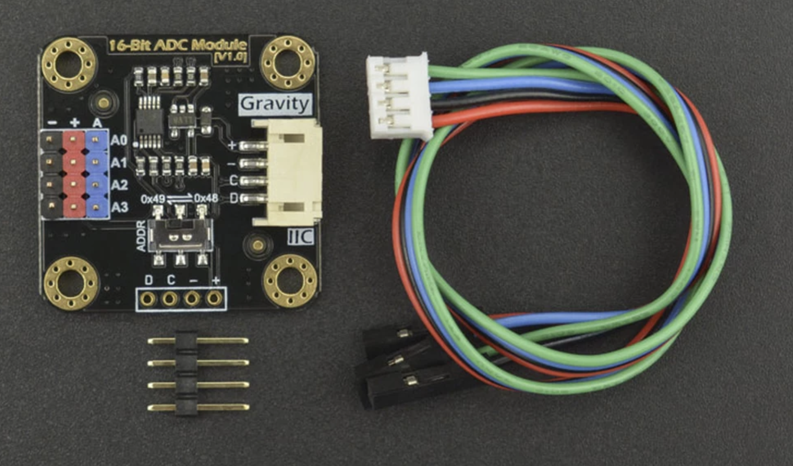

# DFRobot DFR0553 I²C (Gravity ADS1115 16-Bit ADC module) setup

## 🧩 Board Overview



The DFR0553 is essentially the ADS1115 chip in a different form factor

## DFRobot DFR0553 to Raspberry Pi 5 Connection

The DFR0553 module uses standard I2C connections with the following mapping:

| DFR0553 Connector | Wire Color | Raspberry Pi 5 Pin | GPIO/Function |
|------------------|------------|-------------------|---------------|
| **+ (VCC)**      | Red        | Pin 1 or Pin 17   | 3.3V Power   |
| **- (GND)**      | Black      | Pin 6, 9, 14, 20, 25, 30, 34, or 39 | Ground |
| **C (SCL)**      | Blue       | Pin 5             | GPIO 3 (SCL) |
| **D (SDA)**      | Green      | Pin 3             | GPIO 2 (SDA) |

## Physical Connection Steps:

1. **Power Connection (Red wire to +):**
   - Connect to **Pin 1** (3.3V) or **Pin 17** (3.3V) on the Pi's GPIO header

2. **Ground Connection (Black wire to -):**
   - Connect to any available GND pin (Pin 6, 9, 14, 20, 25, 30, 34, or 39)

3. **I2C Clock (Blue wire to C):**
   - Connect to **Pin 5** (GPIO 3 - SCL)

4. **I2C Data (Green wire to D):**
   - Connect to **Pin 3** (GPIO 2 - SDA)

## ASCII Wiring Diagram:
```
Raspberry Pi 5 GPIO Header          DFRobot DFR0553
+------------------------+          +---------------+
| Pin 1  (3.3V) ---------|--------->| + (Red)       |
| Pin 3  (SDA)  ---------|--------->| D (Green)     |
| Pin 5  (SCL)  ---------|--------->| C (Blue)      |
| Pin 6  (GND)  ---------|--------->| - (Black)     |
+------------------------+          +---------------+
```

## Important Notes:
1. **I2C Address:** The DFR0553 typically defaults to address `0x48`. If you need to change this, there should be address selection jumpers on the module.

2. **Existing Setup Compatibility:** This will work perfectly with your existing BME280 sensor since both use the same I2C bus (SDA/SCL pins).

3. **Power Requirements:** The module works with 3.3V-5V, but using 3.3V keeps everything Pi-safe and compatible with your existing setup.

4. ***Both BME280 and DFR0553 (ADS1115) Share the Same I2C Bus** The answer is simple: Connect both modules to the same Pin 3 (SDA) and Pin 5 (SCL). You will probably need a breadboard for that. Check BREADBOARD_README.md

### Why This Works:
- I2C Bus Protocol: Both devices communicate using the same 2-wire I2C protocol (SDA/SCL)
- Different Addresses: Each device has a unique I2C address:
    BME280: typically 0x77 or 0x76
    DFR0553 (ADS1115): typically 0x48
- Shared Power: Both devices can share the same 3.3V and GND connections

## How to test:

If you are using BME280 you alread enabled I2C module. If not, check ***Configuring Raspberry to read BME280 data*** under [BME280_README.md](BME280_README.md) :

You can confirm it’s working with:

```bash
i2cdetect -y 1
```

You should see something like:
```bash
     0  1  2  3  4  5  6  7  8  9  a  b  c  d  e  f
00:                         -- -- -- -- -- -- -- -- 
10: -- -- -- -- -- -- -- -- -- -- -- -- -- -- -- -- 
20: -- -- -- -- -- -- -- -- -- -- -- -- -- -- -- -- 
30: -- -- -- -- -- -- -- -- -- -- -- -- -- -- -- -- 
40: -- -- -- -- -- -- -- -- 48 -- -- -- -- -- -- -- 
50: -- -- -- -- -- -- -- -- -- -- -- -- -- -- -- -- 
60: -- -- -- -- -- -- -- -- -- -- -- -- -- -- -- -- 
70: -- -- -- -- -- -- -- 77
```

## Software Integration:
Code that should work with this module:

```python
import adafruit_ads1x15.ads1115 as ADS
from adafruit_ads1x15.analog_in import AnalogIn

# Your existing I2C setup
ads = ADS.ADS1115(i2c)
ads.gain = 1  # ±4.096V
```

https://wiki.dfrobot.com/Gravity__I2C_ADS1115_16-Bit_ADC_Module_Arduino_%26_Raspberry_Pi_Compatible__SKU__DFR0553#More_Documents


