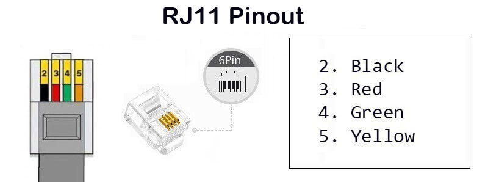

# New wiring

## Pre requisites
- Digital multimeter
- Solder iron and flux
- Soldering supports

## ⚙️ Hardware and Wiring

***SparkFun Weather Meter Kit Anemometer Wiring***

### **What You Need:**

### Hardware:
- Anemometer and wind vane from your SparkFun kit
- 5 RJ45 breakouts (i used simple ones for breakout test and 1, and Goobay Keystone Module RJ45 CAT 6 for 2-4)
- A peace of CAT6 cable without the connectors
- An CAT6 extention
- Opitional: 2 Waterproof junction boxes

### Top level wiring
**This guide will alse include wiring for the rain bucket:**
- RJ45 breakout 1   ---> Breadboard/Pi
- RJ45 breakout 1   ---> CAT 6 extension
- CAT 6 extension   ---> RJ45 breakout 2 (inside waterproof junction box 1)
- RJ45 breakout 2   ---> CAT6 Cable (inside waterproof junction box 1)
- CAT6 Cable        ---> RJ45 breakout 3 (Anemometer/Vane) (inside waterproof junction box 2)
- CAT6 Cable        ---> RJ45 breakout 4 (Rain bucket) (inside waterproof junction box 2)
- Wind Vane RJ 11   ---> RJ45 breakout 3 (inside waterproof junction box 2)
- Rain bucket RJ 11 ---> RJ45 breakout 4 (inside waterproof junction box 2)
- Anemometer RJ 11  ---> Wind Vane RJ11 female

### Identify connections
This RJ11 to RJ45 is tricky. My suggestion, bring the whole kit mounted inside (including the stand), next to you work bench and test with the multimeter.
Connect the RJ11 connector from vane/anemometer to test RJ45 breakout for testing.

**Anemometer Wire Identification:**

The anemometer uses only 2 wires - they act as a simple switch:

One connects to Ground
One is the Signal (needs pull-up resistor)

1. Find which wires are for anemometer:
    - Set multimeter to continuity/diode mode (beep mode)
    - Spin the anemometer cups slowly
    - Test all wire pairs
    - The pair that beeps intermittently as you spin = Anemometer wires

2. Once you find the anemometer pair:

    Since either wire can be ground or signal (it's just a switch).
    In my case, it was the pins 4 and 5 from the RJ45 breakout, so I'm assuming RJ11 Yellow as ground and RJ11 Red as anemometer signal
    So, on test RJ45 breakout, Pin 4 is RJ11 Red (anemometer signal, purple DuPont) and Pin 5 is RJ11 Yellow (GND, black DuPont)

That leaves 2 pins for the wind vane. But the vane needs 3 wires (Power, Ground, Signal), and you only have 2 remaining...
***The Answer: Shared Ground!***

**Wind Vane Wire Identification:**

1. Power-Up Test:
    - Black wire (RJ11 Pin 2, RJ45 pin 3) → Breadboard 3.3V (Power)
    - Yellow wire (RJ11 Pin 4, RJ45 pin 5) → Breadboard GND (Ground)
    - Green wire (RJ11 Pin 5, RJ45 pin 6) → Multimeter Red probe
    - Breadboard GND (Ground) → Multimeter Black probe
    - Set multimeter to DC Voltage (V˜ range) position 20m
    - Rotate vane slowly
    ***You should see voltage varying between ~0.4V to 2.8V as you rotate through the 16 positions!***

**Bench test:**
Once you have the wire identified on a test breakout test the vane and anemometer on Pi
1. Connect wires:
    - RJ45 breakout Pin 3 → Breadboard Power rail
    - RJ45 breakout Pin 4 → Breadboard 15C
    - RJ45 breakout Pin 5 → Breadboard GND rail
    - RJ45 breakout Pin 6 → Breadboard 20A

2. Test the anemometer:
    - Connect to Pi via ssh
    - Activate pyenv (conda activate python311)
    - Go to folder weather-station/scripts/anemo
    - Run the scripts on there and follow the instructions

3. Test the vane:
    - Switch to folder weather-station/scripts/windvane
    - Cry on your bed

### Procedure
#### For each connection, test continuity using the multimeter
Trust me, it will save you a lot of troubleshoot time

#### RJ45 breakout 1   ---> Breadboard/Pi
    | RJ45 breakout pin| DuPont Cable | Function      | Connect to   |
    |------------------|--------------| ------------- | ------------ |
    | Pin 1	           | Red          | Power         | Power Rail 2 |
    | Pin 2	           | Black        | GND           | GND Rail 2   |
    | Pin 3	           | Blue         | GPIO3 (Clock) | 2B           |
    | Pin 4	           | Green        | GPIO2 (Data)  | 4B           |
    | Pin 5	           | Purple       | Vane Signal   | 20A/D        |
    | Pin 6	           | Orange       |               |              |
    | Pin 7	           | White        | Anemo Signal  | 14D          |
    | Pin 8	           | Brown        | Rain Signal   |              |

#### RJ45 breakout 2   ---> CAT6 Cable
    | RJ45 breakout pin| CAT6 Color   | Function      | Extension*   | Connect to |
    |------------------|--------------| ------------- | ------------ |----------- |
    | Pin 1	           | White/Orange | Power         | DuPont Red   | BME280 +   |
    | Pin 2	           | Orange       | GND           | DuPont Black | BME280 +   |
    | Pin 3	           | White/Green  | GPIO3 (Clock) | DuPont Blue  | BME280 SCL |
    | Pin 4	           | Blue         | GPIO2 (Data)  | DuPont Green | BME280 SDA |
    | Pin 5	           | White/Blue   | Vane Signal   |     ---      | DFR0553 A0 |
    | Pin 6	           | Green        | Not in use    |     ---      |            |
    | Pin 7	           | White/Brown  | Anemo Signal  |     ---      | GPIO17     |
    | Pin 8	           | Brown        | Rain Signal   |     ---      |            |
     * You will need to iron sold these

#### RJ45 breakout 3 (Anemometer/Vane)
**SparkFun Weather Meter RJ11 Connector Pinout**
The Connector Pinout is different from the RJ11 standard:
    

When looking at the contact part of the connector: Green, Yellow, Red, Black (pins 1-4)

    **RJ11 to RJ45 Mapping:**
    | RJ11 Pin | Wire Color | Function           | RJ45 Pin | CAT6 Color   | Notes                         |
    |----------|------------|--------------------|----------|--------------|-------------------------------|
    | Pin 1    | Green      | Wind Vane Signal   | Pin 3    | White/Blue   | Analog voltage, To DFR0553 A0 |
    | Pin 2    | Yellow     | Ground (GND)       | Pin 4    | Orange       | Shared ground                 |
    | Pin 3    | Red        | Anemometer Signal  | Pin 5    | White/Brown* | Reed switch, to GPIO17        |
    | Pin 4    | Black      | Power (3.3V)       | Pin 6    | White/Orange | Powers resistors              |
    * It should have be the green, but it is not working

#### RJ45 breakout 4 (Rain Bucket) (tbd)
    | RJ45 breakout pin| CAT6 Color   | Function    | Notes           |
    |------------------|--------------| ------------| --------------- |
    | Pin 1	           |              |             |                 |
    | Pin 2	           |              |             |                 |
    | Pin 3	           |              |             |                 |
    | Pin 4	           | Brown*       | Rain Signal |                 |
    | Pin 5	           | Orange*      | GND         | From breakout 3 |
    | Pin 6	           |              |             |                 |
    | Pin 7	           |              |             |                 |
    | Pin 8	           |              |             |                 |
    * Decap a long peace from CAT6 cable or iron sold an extension here
