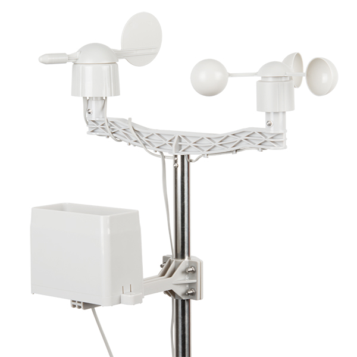
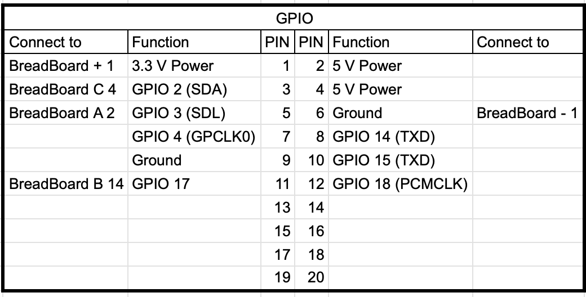
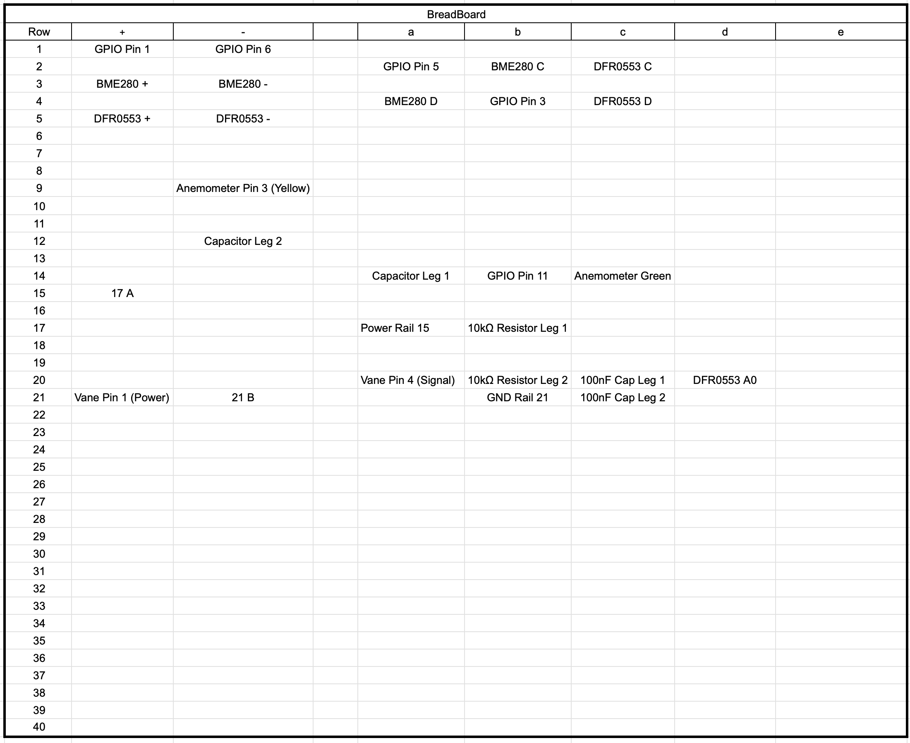

# SparkFun Weather Meter Kit Wind Vane Setup

## 🧩 Kit Overview




## ⚙️ Hardware and Wiring

***SparkFun Weather Meter Kit Wind Vane Wiring***
- The SparkFun Weather Meter Kit wind vane uses a resistor network that requires connection to your DFR0553 (ADS1115) analog input for reading wind direction.

- RJ11 Connector Pinout (Wind Vane)
The SparkFun Weather Meter Kit uses RJ11 connectors with the following a standard pinout.

But, due to our RJ breakout unusual color pattern we already discussed on Anemometer setup, check the following table for connection

    | RJ11 Pin| Wire Color | Function                | Connection                     | Leroy conector | DuPont Wire soldered |
    |---------|------------|-------------------------| ------------------------------ | -------------- | -------------------- |
    | Pin 2	  | Black      | VCC (Power)             | Connect to 3.3V                | Yellow         | Yellow Female        |
    | Pin 3	  | Red        | Wind Speed (Anemometer) | Connect to Pi Pin 11 (GPIO 17) | Green          | Green Female         |
    | Pin 4	  | Yellow     | Ground                  | Connect to GND                 | Red            | Purple Male          |
    | Pin 5	  | Green	   | Wind Vane Signal        | Connect to DFR0553 A0          | Black          | Brown Male           |

    **The Pins 1 and 4 function confirmed.**

### Wiring diagram so far:

- Pi

     

- BreadBoard

     


### Circuit Diagram
```bash
Power Rail → 10kΩ (17A→17B→20B) → Junction (Row 20) → ADS1115 A0 (20D)
                                      ↓
                                 100nF (20C→21D) → GND Rail
                                      ↓
                               Wind Vane Signal (20A - Brown)
```

## install python prereqs:
```bash
pip install adafruit-circuitpython-ads1x15
```

## Calibrate your readings

Use script scripts/wind_vane_test.py

The one that worked better for me is different from spec. Maybe the spec refer to south emisphere readings?

# Voltage tolerance for direction matching (volts)
TOLERANCE = 0.05

# Wind direction mapping based on your actual hardware calibration
# Custom calibrated values from your SparkFun Weather Kit + 10kΩ voltage divider
# Note: Some adjacent directions have identical voltages - hardware limitation
VOLTAGE_TO_DIR = {
    0.252: 202.5,  # SSW
    0.254: 180.0,  # S
    0.441: 225.0,  # SW
    0.602: 247.5,  # WSW (Note: very close voltage voltage to SW)
    0.763: 270.0,  # W
    1.043: 292.5,  # WNW (Note: very close voltage voltage to W)
    1.260: 135.0,  # SE
    1.261: 157.5,  # SSE
    1.802: 315.0,  # NW
    1.974: 337.5,  # NNW
    2.255: 67.5,   # ENE
    2.356: 90.0,   # E
    2.437: 112.5,  # ESE (Note: very close voltage to E)
    2.681: 45.0,   # NE
    2.858: 22.5,   # NNE
    2.973: 0.0,    # N
}


## 📚 References

- [Weather Meter Kit product page](https://www.sparkfun.com/weather-meter-kit.html)
- [Weather Meter Hookup Guide](https://learn.sparkfun.com/tutorials/weather-meter-hookup-guide)
- [Weather Sensor Assembly](https://cdn.sparkfun.com/assets/8/4/c/d/6/Weather_Sensor_Assembly_Updated.pdf)
- [Datasheet](https://cdn.sparkfun.com/assets/d/1/e/0/6/DS-15901-Weather_Meter.pdf)
- [Arduino Library](https://github.com/sparkfun/SparkFun_Weather_Meter_Kit_Arduino_Library)